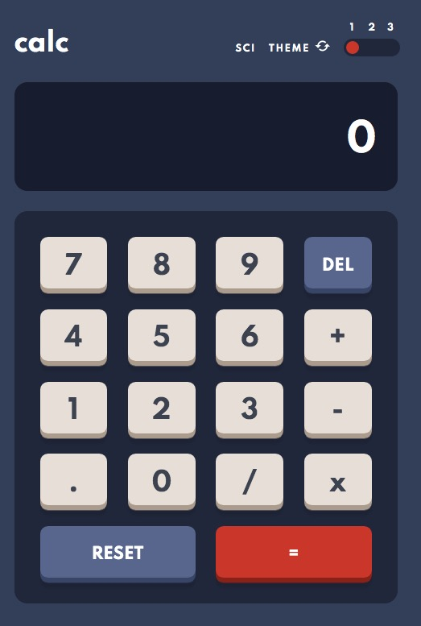
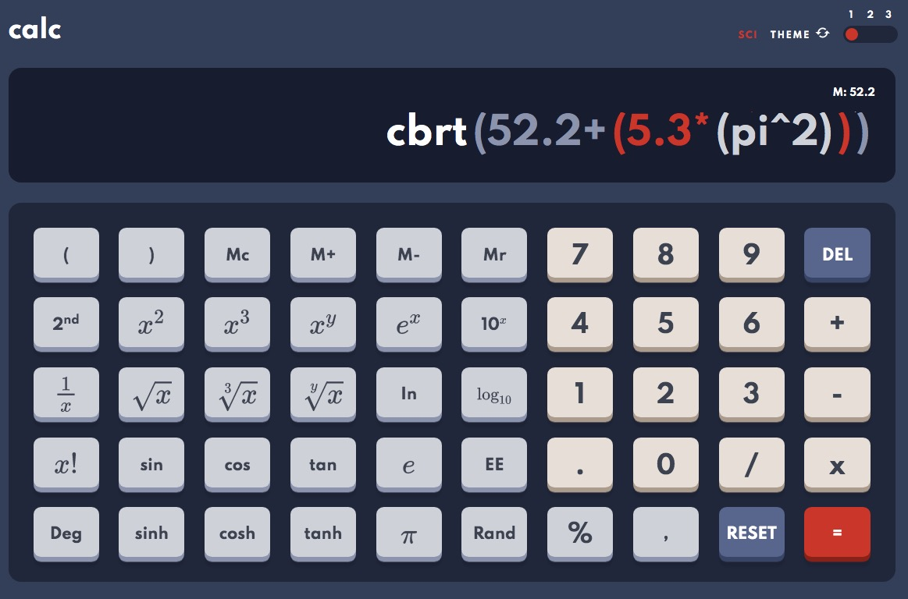

# Frontend Mentor - Calculator app solution

This is a solution to the [Calculator app challenge on Frontend Mentor](https://www.frontendmentor.io/challenges/calculator-app-9lteq5N29). Frontend Mentor challenges help you improve your coding skills by building realistic projects.

## Overview

### The challenge

Users should be able to:

- See the size of the elements adjust based on their device's screen size
- Perform mathmatical operations like addition, subtraction, multiplication, and division
- Adjust the color theme based on their preference
- **Bonus**: Have their initial theme preference checked using `prefers-color-scheme` and have any additional changes saved in the browser

### Screenshot

### Links

- [Solution URL](https://www.frontendmentor.io/solutions/normalscientific-calculator-Kk1mKUeBd)
- [Live site](https://frontendmentor-calculator.netlify.app/)

## My process

### Built with

- Semantic HTML5 markup
- CSS custom properties
- Flexbox
- CSS Grid
- Mobile-first workflow
- [MathJs](https://mathjs.org/)

### Useful resources

- [Webpack Tutorials by Swashbuckling with Code](https://www.youtube.com/playlist?list=PLmZPx_9ZF_sB4orswXdpThGMX9ii2uP7Z) - Great Webpack tutorials that helped me a lot.
- [Animated switch for radio buttons (css only)](https://codepen.io/fredjens/pen/adqLNO/) - I adapedet this switch by Frederik Jensen.

## Author

- Frontend Mentor - [@Filippo-B](https://www.frontendmentor.io/profile/Filippo-B)
